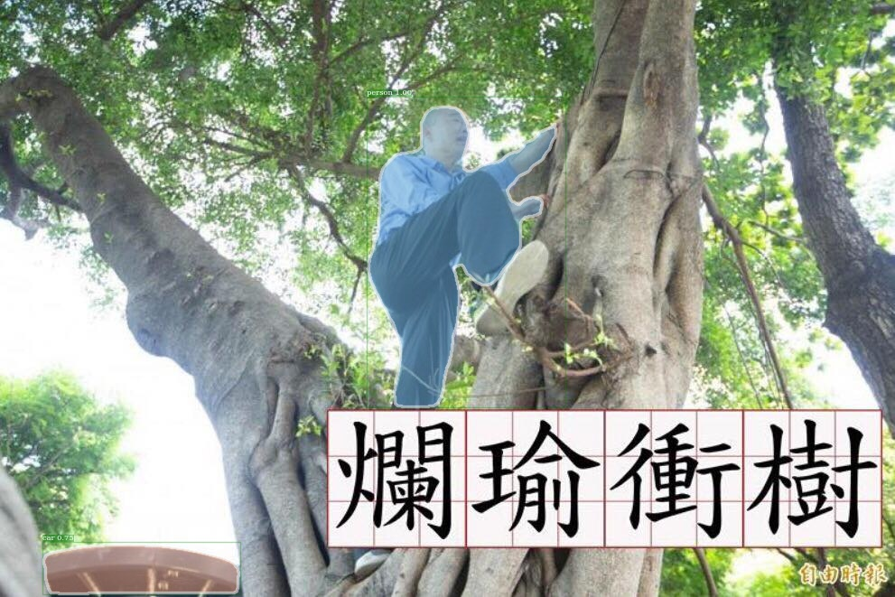
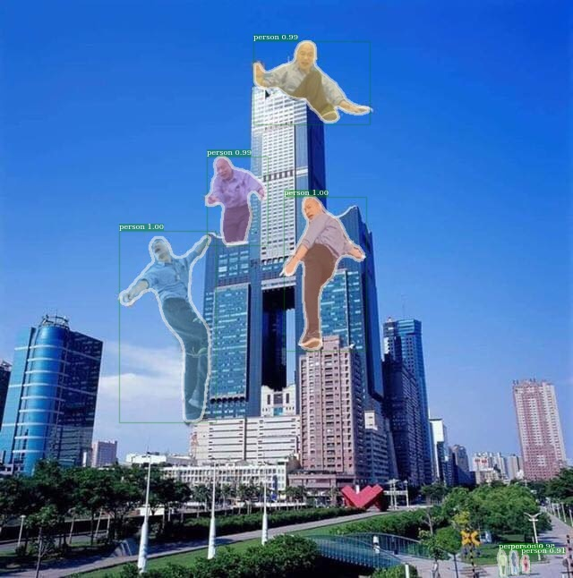

# Update
* 20190725 First update

# TODOs
* add train flow kubernetes yaml template

# Detectron
Detectron is the object detection collection from Facebook Research. Original repo is [here](https://github.com/facebookresearch/Detectron). Since facebook research version could encounter some errors during parsing yaml file, I have fixed this issue by fixing pyyamml version in requirement.txt. [Related Issue](https://github.com/facebookresearch/Detectron/issues/840) In my repository I use [my forked version](https://github.com/TeeboneTing/Detectron) of Detectron and works well now.

# How to use
* Clone this repository with submodule: `git clone --recursive git@github.com:TeeboneTing/Detectron_k8s.git`
* Build image: `make build`
* If you would like to push to your dockerhub repository, please change your username in Makefile line 3 and `make push_dockerhub`
* Run image by `docker run -ti teeboneding/detectron bash`
* Execute example inference command inside container from [GETTING_STARTED](https://github.com/TeeboneTing/Detectron/blob/master/GETTING_STARTED.md):
``` bash
python tools/infer_simple.py \
    --cfg configs/12_2017_baselines/e2e_mask_rcnn_R-101-FPN_2x.yaml \
    --output-dir /tmp/detectron-visualizations \
    --image-ext jpg \
    --wts https://dl.fbaipublicfiles.com/detectron/35861858/12_2017_baselines/e2e_mask_rcnn_R-101-FPN_2x.yaml.02_32_51.SgT4y1cO/output/train/coco_2014_train:coco_2014_valminusminival/generalized_rcnn/model_final.pkl \
    demo
```
* Some example output images:




